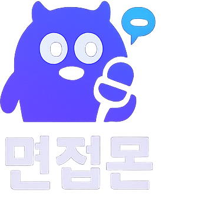

  

  
  

  

 

## 📌 목차
1. [프로젝트 소개](#1-프로젝트-소개)  
2. [기획 의도](#2-기획-의도)  
3. [핵심 기능](#3-핵심-기능)  
4. [전체 구조](#4-전체-구조)  
5. [기술 스택](#5-기술-스택)  
6. [팀](#6-팀)  
7. [자료](#7-자료)  

 

##  1. 프로젝트 소개
면접몬은 집에서도 **실전처럼 모의면접을 진행**하고, 답변을 기준으로 **즉시 피드백**을 받을 수 있도록 만든 프로젝트입니다.  
기업/직무별 질문을 타임어택 형태로 제시하고, 답변 기록을 남겨서 반복 연습 흐름을 만들었습니다.

 

##  2. 기획 의도
- 면접 준비가 막히는 지점은 “무엇을 / 얼마나 / 어떻게” 피드백 받을지에서 시작된다고 봤습니다.
- 연습은 많이 했는데, 결과가 남지 않거나(기록 부재) 피드백이 없어서(개선 포인트 부재) 반복 효율이 떨어졌습니다.
- 그래서 질문 → 답변 → 피드백 → 재도전까지 한 번에 이어지는 흐름으로 묶는 것을 목표로 잡았습니다.

 

##  3. 핵심 기능
### 3.1 타임어택 모의면접
- 문항 수/난이도(시간 제한)를 선택하고 질문을 순서대로 진행합니다.
- 답변은 진행 중 자동 저장(세션)되어 중단해도 이어서 진행할 수 있습니다.

### 3.2 음성 기반 연습 + 자막(STT) / 질문 읽기(TTS)
- 브라우저 Web Speech API를 사용해 **음성 입력(STT)** 및 **질문 읽기(TTS)** 흐름을 제공합니다.
- 말로 연습해도 기록이 남아 복습이 가능합니다.

### 3.3 AI 피드백(점수 + 코칭)
- 답변을 기반으로 항목별 점수/요약/개선점을 제공하는 형태로 구성했습니다.
- 피드백 결과는 세션 기록에 남아 비교/회고가 가능합니다.

### 3.4 질문 관리(확장)
- 기업/직무별 질문 풀을 기반으로 랜덤/유형별 출제 흐름을 확장할 수 있게 설계했습니다.

 

##  4. 전체 구조
<pre>
[ Frontend (React) ]
        ↓
[ REST API ]
        ↓
[ Backend (Node/Express) ]
        ↓
[ MySQL ]
        ↓
[ OpenAI (Feedback) ]
</pre>

- 화면(UI)과 사용자 흐름은 프론트에서 처리합니다.
- 인증/세션/DB 저장/AI 피드백 요청은 백엔드에서 처리합니다.

 

##  5. 기술 스택
- **Frontend**: React (Create React App), TypeScript, react-router-dom, axios, framer-motion, recharts  
- **Backend**: Node.js, Express, MySQL (mysql2), JWT (jsonwebtoken), Password Hashing (bcryptjs), Validation (zod), Security (helmet, express-rate-limit), Logging (morgan), OpenAI SDK  

 

##  6. 팀
- 신민수: 프로젝트 총괄, 백엔드 개발, 설계/발표
- 김민식: 백엔드 개발, DB 설계, 유지보수
- 이준환: 프론트엔드 개발, UI/발표자료 보조

 

##  7. 자료
- `면접몬 프로젝트.pdf`
- `간단소개.pdf`
- `간단소개2.pdf`
- `로고.png`, `누끼로고.png`
